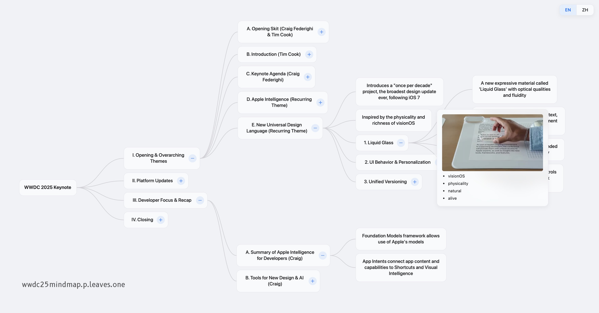

# WWDC 2025 Keynote Interactive Mind Map

This project is an interactive visualization of the WWDC 2025 keynote announcement, built with D3.js.

### The Idea

It's a proof-of-concept to automate the creation of a visual summary. The workflow is:

1. LLM processed the official keynote subtitles into a structured Markdown file.
2. The LLM also identified timestamps for important visual moments.
3. A script using FFmpeg to extract video frames from the video at those timestamps.
4. The D3.js webpage parses the Markdown and displays the information, with the extracted frames appearing in tooltip HUDs.

Happy WWDC 2025!
